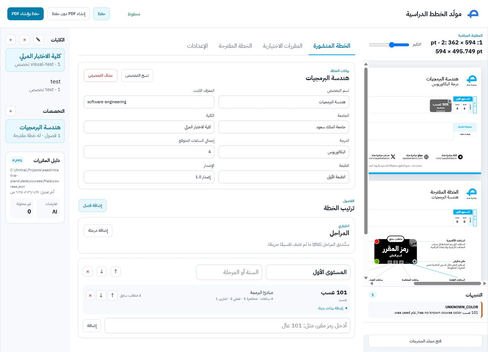

<div align="center">
  
  <h1>Saad Academic Plan Generator</h1>
  <p>Arabic-first academic-plan editing, validation, preview, and export.</p>
  <p>
    
    
    
    
    <a href="https://github.com/ahmkhale/saadinitiative-plans/actions/workflows/validate.yml"></a>
  </p>
</div>

<p align="center">
  
</p>

<p align="center"><sub>The editor combines structured plan data, validation diagnostics, and a live PDF preview.</sub></p>

Saad is a local academic-plan editor for maintaining university curricula and producing consistent, print-ready plans. It combines institution metadata, plan-owned academic rules, course catalogs, fallback facts, measured layout, and export in one deterministic pipeline.

## Start here

### Requirements

- Node.js 20 or newer
- Inkscape for SVG-to-PDF/PNG export
- IBM Plex Sans Arabic font files in `font/` or the directory named by `SAAD_FONT_DIR`
- Ghostscript is optional; when available, it makes the final PDF smaller while preserving fonts, dimensions, and links

### Run the editor

```powershell
npm install
npm run gui
```

Open [http://127.0.0.1:4174](http://127.0.0.1:4174). The GUI and its local API are started together by `npm run gui`.

Before sharing changes, run the repository checks:

```powershell
npm run validate
```

GitHub Actions runs the same validation on every push and pull request. The workflow can also be started manually from the repository’s Actions tab.

For optional browser-based font and rendering checks:

```powershell
npm run test:browser
```

## Generate plans from the command line

Generate one plan, including SVG and PNG previews:

```powershell
npm run generate -- "institutions/ksu/colleges/engineering/majors/electrical-engineering/plan.json" --svg --png
```

Generate every plan under `institutions/`:

```powershell
npm run generate:all -- institutions --svg --png
```

Generated files are written under the ignored `dist/<institution-id>/<college-id>/<plan-id>/` directory. Depending on the flags, the directory contains a PDF, SVG, PNG, resolved plan JSON, and diagnostics JSON.

To inspect export behavior without the optional Ghostscript pass:

```powershell
npm run generate -- "path/to/plan.json" --no-pdf-optimize
```

Other export flags are `--require-pdf-optimize` and `--ghostscript <path>`.

## How the data is organized

Repository location and file ownership are intentional:

| Source | Owns |
| --- | --- |
| `institutions/<institution>/` | Institution identity and settings |
| `colleges/<college>/` | College identity and metadata |
| `majors/<major>/plan.json` | The editable parent plan and its academic rules |
| `tracks/<track>/plan.json` | A child overlay that composes with its parent plan |
| `catalogs/<institution>/` | Published course facts by catalog term and gender |
| `fallbackCourses` in the owning plan | Durable facts entered when a catalog cannot resolve a course |

Plans do not duplicate institution or college metadata. Edition and release values come from institution settings. Course facts are kept separate from plan-owned requirements such as prerequisites, corequisites, minimum completed credits, and textual conditions.

Catalog lookup follows this order:

```text
active Male catalog → active Female catalog → owning fallbackCourses → unresolved
```

When a track exists, the parent plan is composed first; the track appends its own content and identity. Track markers are derived during composition and are not authored in plan files.

## Key behaviors

- Stable course-occurrence IDs keep prerequisites and proposal placement reliable.
- Published courses sort by course number, then Arabic subject.
- A parent marker appears only when a published course is a prerequisite of a later published course.
- Same-semester prerequisites, corequisites, elective dependencies, and proposal movement do not create parent markers.
- Proposals reference published occurrence IDs and never mutate the published plan.
- Missing activity siblings become zero only when at least one activity value is known.
- Every PDF page is 594 pt wide; height is derived independently for each page.
- The local IBM Plex Sans Arabic font is used for both browser measurement and export.
- Footer hyperlinks remain active in the exported PDF.

## Architecture

The main pipeline is:

```text
repository plan + scoped sources + catalog + settings
        ↓
normalize and validate
        ↓
compose and resolve course facts
        ↓
reconcile proposals
        ↓
measure layout and compose SVG
        ↓
export compact PDF / PNG
```

The code is divided by responsibility:

```text
src/domain/          Pure academic rules and derived behavior
src/application/     Pipeline orchestration and workflows
src/infrastructure/  Filesystem, catalog, repository, and export adapters
src/presentation/    Measured layout and SVG composition
gui-app/             React editor and preview UI
gui/                 Legacy GUI modules and compatibility surface
```

Root entry points such as `generate.mjs`, `pipeline.mjs`, `exporter.mjs`, and `preview.mjs` remain thin facades over these modules.

## Compact PDF export

Before export, course-card and activity-box translucency is pre-composed into equivalent solid colors. This avoids hundreds of unnecessary transparency objects while keeping the approved appearance unchanged.

If Ghostscript is available through `GHOSTSCRIPT_PATH`, `--ghostscript`, or a standard installation, the exporter performs a second vector-preserving rewrite. Fonts, page dimensions, and URL annotations are retained.

## Documentation

- [Architecture](./docs/ARCHITECTURE.md)
- [Data model](./docs/DATA_MODEL.md)
- [GUI guide](./docs/GUI.md)
- [Figma measurements](./docs/FIGMA_MEASUREMENTS.md)
- [Known limitations](./docs/KNOWN_LIMITATIONS.md)

The visual contract is based on the approved [Plans Figma file](https://www.figma.com/design/3r0vSL0tBOx2y2PKPz4FK3/Plans?node-id=381-80662).

## Development notes

The repository uses a canonical model: schema, fixtures, tests, GUI, renderer, and documentation should evolve together. Writes are atomic, and compatibility files should remain thin rather than introducing parallel schemas or migration layers.

## License

Proprietary and confidential. Copyright © 2026 Saad Initiative. See [LICENSE.md](./LICENSE.md).
