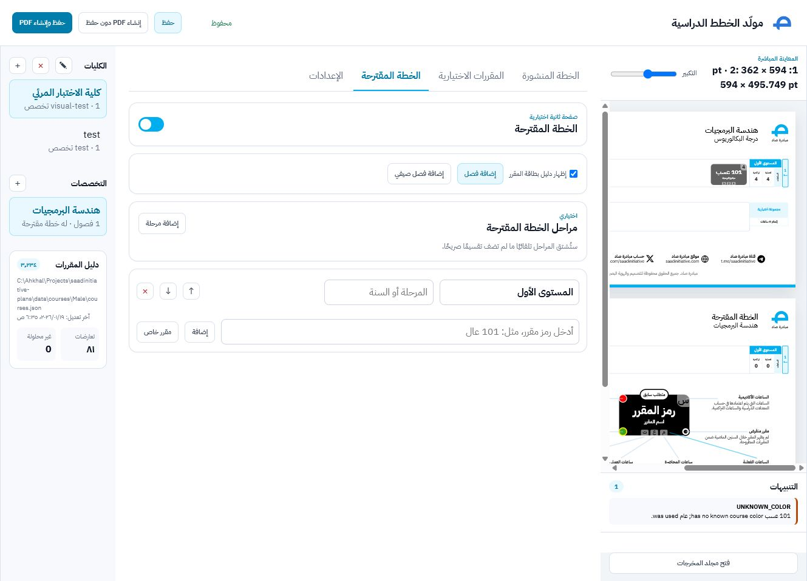

# Local GUI

The local GUI is an Arabic RTL operator interface over the same resolver, layout,
SVG renderer, and exporter used by the CLI.

## Start

Install Node.js 20+, install Inkscape, then run:

```bash
npm install
npm run gui
```

Open `http://127.0.0.1:4174`. The server binds to localhost only. Set `PORT` to
use another port.

## Operator workflow

1. Add or open a college.
2. Add, open, rename, duplicate, or delete a major.
3. Add and reorder semesters.
4. Enter course codes. Search suggestions come from the shared catalog.
5. Review the derived name, hours, requirements, color, totals, and diagnostics.
6. Add elective groups, required hours, and their course codes.
7. Optionally enable a proposal, summer semester, phases, guide, or explicit
   placeholder courses.
8. Save, then generate the PDF.

The preview updates from unsaved state after a short debounce. It displays the
actual SVG returned by the shared renderer; it is not a separate HTML
approximation.




## Storage

Canonical plan decisions are atomically persisted as:

```text
colleges/<college-id>/<major-id>/plan.json
```

Writes go through a temporary sibling file and atomic rename. The GUI does not
maintain a database, account, or separate UI-state document. Derived course
facts and renderer coordinates are not copied into `plan.json`.

The default catalogs are loaded in this order:

1. `data/courses/Male/courses.json` as the primary catalog;
2. `data/courses/Female/courses.json` for codes absent from the primary catalog.

For an individual course, resolution remains:

```text
explicit per-plan override -> catalog -> fallbackCourses -> error
```

The catalog panel reports its path, modification time, course count, definition
conflicts, and the current plan's unresolved count.

## Exceptional course data

Normal course entry accepts codes only. If a code is absent from both catalogs,
the diagnostic and course row expose a focused fallback dialog. Overrides and
dependency decisions are kept in a collapsed advanced section and can be reset.
The generator never invents missing required facts.

## Preview, diagnostics, and export

- Every page is exactly `594 pt` wide.
- Height is derived independently from that page's content.
- Published and proposal pages may have different heights.
- Blocking errors disable both PDF actions.
- Warnings remain visible but do not block export.
- `Save and generate PDF` is the primary action.
- `Generate PDF without saving` exports the draft in memory.
- SVG is retained only when selected; PNG is an optional debug export.
- `Open output directory` opens the local `dist` folder.

The output includes PDF plus resolved JSON and diagnostics. SVG is temporary
unless retained explicitly.

## Manually verified workflow

The July 26, 2026 smoke test used an isolated data root and covered:

- college and major creation through in-page dialogs;
- code-only entry of `101 عسب`;
- automatic resolution to `مبادئ البرمجة` and four academic hours;
- immediate unsaved preview and diagnostics;
- elective-group creation;
- enabling an optional proposal and guide;
- different published/proposal heights (`362 pt` and `495.749 pt` in that
  composition);
- atomic save;
- PDF generation and the returned PDF link.

The resulting smoke-test PDF was written to:

```text
dist/software-engineering/plan.pdf
```

## Troubleshooting

- If PDF or PNG export fails, verify that `inkscape` is on `PATH`.
- If typography differs from Figma, install the IBM Plex Sans Arabic weights
  used by the design. Font binaries intentionally remain outside the repository.
- If export is disabled, resolve all error diagnostics first.
- Catalog conflicts are informational unless they affect a selected course;
  the Male catalog wins for duplicate codes.
