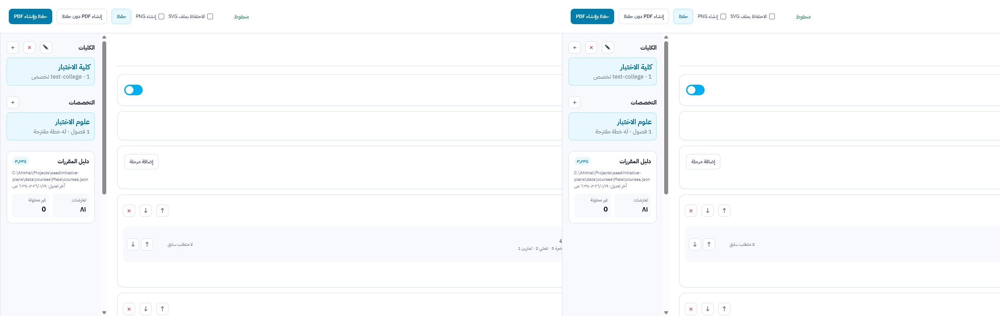

# Local GUI

The local GUI is an Arabic RTL operator interface over the same resolver, layout,
SVG renderer, and exporter used by the CLI.

## Start

Install Node.js 20+, install Inkscape, then run:

```bash
npm install
npm run gui
```

Open `http://127.0.0.1:4174`. The server binds to localhost only. Set `PORT` to
use another port.

## Operator workflow

1. Add or open a college.
2. Add, open, rename, duplicate, or delete a major.
3. Set the shared edition/release once and create reusable semester sets when
   several majors share the same foundation.
4. Reference shared semesters, then add the major-owned semesters. Shared
   semesters remain read-only in the plan and offer an action to open their source.
5. Enter course codes. Published semester and elective entries sort automatically
   by course number then Arabic subject.
6. Review the visible source badge: `دليل الطلاب`, `دليل الطالبات`,
   `مدخل يدويًا`, `بيانات متعارضة`, or `بيانات ناقصة`.
7. If a code is absent from both section sources, complete its name and all four
   hour fields inline. Zero is a valid explicit value.
8. Set prerequisites, corequisites, minimum completed hours, and track status as
   first-class plan rules.
9. Add elective groups and choose exactly one requirement mode: hours or custom
   text such as `غير متطلب للتخرج`.
10. Optionally enable a proposal. It starts with every published real course
    exactly once. Drag real courses to arrange them, and add/delete only explicit
    placeholder cards.
11. Save, then generate the PDF.

The preview updates from unsaved state after a short debounce. It displays the
actual SVG returned by the shared renderer; it is not a separate HTML
approximation.




## Storage

Canonical plan decisions are atomically persisted as:

```text
colleges/<college-id>/<major-id>/plan.json
```

Writes go through a temporary sibling file and atomic rename. The GUI does not
maintain a database, account, or separate UI-state document. Derived course
facts and renderer coordinates are not copied into `plan.json`.

The default section sources are loaded in this order:

1. `data/courses/Male/courses.json` as the primary catalog;
2. `data/courses/Female/courses.json` for codes absent from the primary catalog.

Section files are lookup accelerators, not complete academic catalogs. For an
individual course, resolution remains:

```text
explicit fact override -> Male -> Female -> fallbackCourses -> error
```

The catalog panel reports paths, modification times, course count, definition
conflicts, and the current plan's unresolved count. Provenance is preserved
through section aggregation.

## Exceptional course data

Normal course entry accepts codes only. If a code is absent from both sources,
the row expands immediately and requires name, academic hours, lecture hours,
exercise hours, and practical hours. The values persist in `fallbackCourses`.
When that course later appears in a section source, the GUI reports the new
catalog availability without silently discarding the manual definition.

Plan-owned prerequisites, corequisites, minimum completed hours, and track status
remain on the semester/elective entry. Returning to catalog facts never deletes
those rules. The generator never invents missing required facts and never
converts an omitted contact-hour field to zero.

## Shared settings and semester sources

Global edition/release settings live in `data/settings.json` and update live
previews. New plans inherit them; an older plan may retain a deliberate explicit
exception.

Shared semester sets are managed in Settings. They may contain multiple semesters
and compose other sets. Plans reference their IDs instead of copying their
courses. The GUI shows current usage counts and blocks deletion while any plan or
shared set still references the source.

## Proposal invariant

Proposal storage is arrangement only. Across its semesters, the real-course set
must equal the published semester and elective set exactly once. The GUI has no
add/delete action for real proposal courses. Pointer drag-and-drop controls
placement; arrow buttons provide a within-semester fallback. Explicit placeholder
cards are additive data, remain black in the PDF, and render after real courses.

Legacy proposal shapes are normalized when opened. Before their first canonical
save, the store writes a timestamped `plan.before-proposal-migration.*.json`
backup beside the plan.

## Preview, diagnostics, and export

- Every page is exactly `594 pt` wide.
- Height is derived independently from that page's content.
- Published and proposal pages may have different heights.
- Blocking errors disable both PDF actions.
- Warnings remain visible but do not block export.
- `Save and generate PDF` is the primary action.
- `Generate PDF without saving` exports the draft in memory.
- SVG is retained only when selected; PNG is an optional debug export.
- `Open output directory` opens the local `dist` folder.

The output includes PDF plus resolved JSON and diagnostics. SVG is temporary
unless retained explicitly.

## Manually verified workflow

The July 26, 2026 smoke test used an isolated data root and covered:

- college and major creation through in-page dialogs;
- Male-source resolution of `101 عسب` with a visible provenance badge;
- shared edition/release settings;
- creation, attachment, and read-only rendering of a two-semester shared source;
- immediate expansion and export blocking for missing `999 جدد`;
- complete manual facts with explicit zero exercise hours and a manual badge;
- first-class prerequisites, corequisites, minimum hours, and track status;
- immediate unsaved preview and diagnostics;
- elective custom requirement text;
- enabling a constrained proposal containing all published real courses;
- an explicit placeholder course and two-page preview;
- atomic save;
- PDF generation and the returned PDF link.

## Troubleshooting

- If PDF or PNG export fails, verify that `inkscape` is on `PATH`.
- If typography differs from Figma, install the IBM Plex Sans Arabic weights
  used by the design. Font binaries intentionally remain outside the repository.
- If export is disabled, resolve all error diagnostics first.
- Catalog conflicts are informational unless they affect a selected course;
  the Male catalog wins for duplicate codes.
